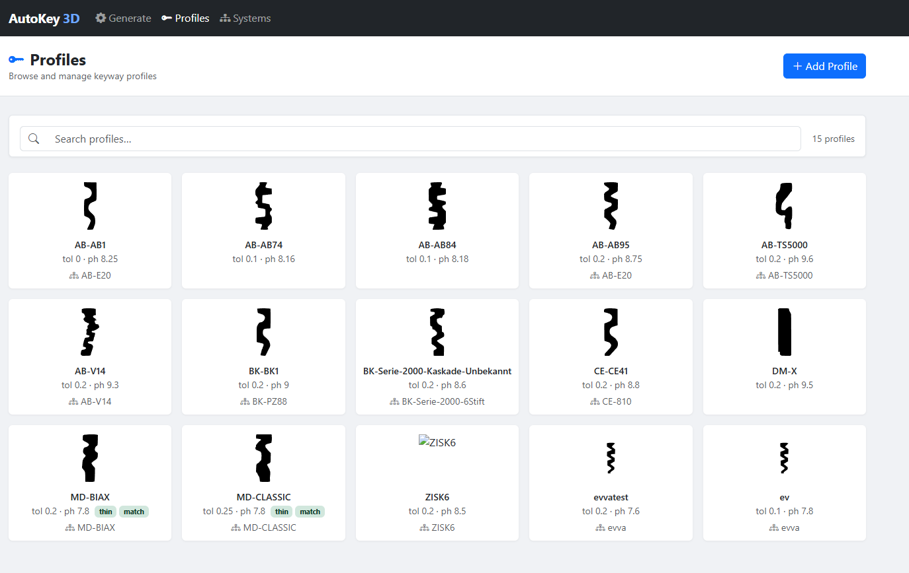
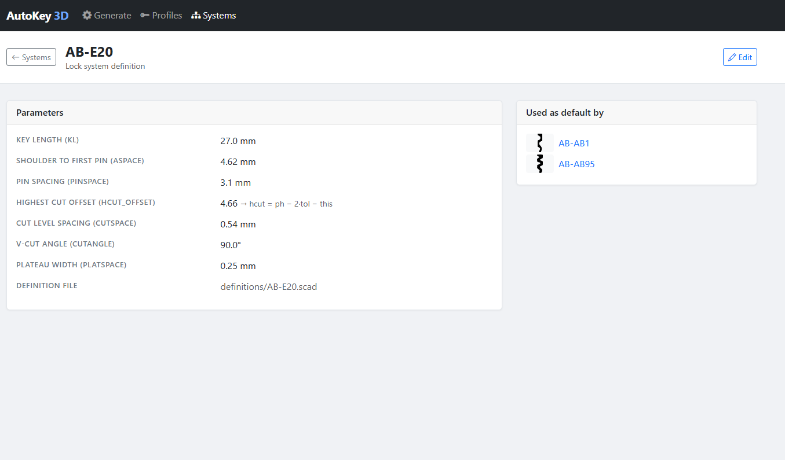
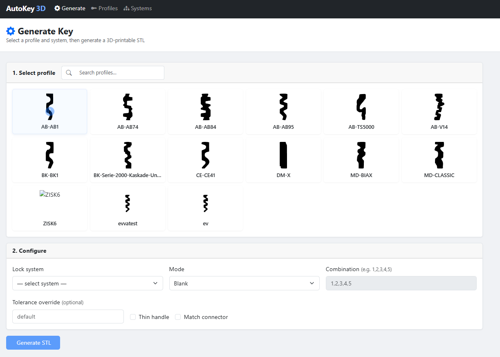

# AutoKey3D

AutoKey3D is a tool for generating 3D-printable models of key blanks, bump keys, and regular keys. It ships with a modern web UI and runs entirely in Docker — no local installs required.

## License

Released under the **CC BY-NC-SA 4.0** non-commercial license. See [LICENSE](LICENSE) for the full text.

### About

Written by Christian Holler (:decoder). Questions: `decoder -at- own-hero -dot- net`

First presented at LockCon 2014, Sneek, NL. Recorded talk: https://www.youtube.com/watch?v=3pSa0pslxpU

---

## Requirements

> **Docker is required.** No other local dependencies need to be installed.

- [Docker Desktop](https://www.docker.com/products/docker-desktop/) (includes Docker Compose)

---

## Quick Start

```bash
# Clone the repo
git clone https://github.com/kaa-serpent/autokey3d.git
cd autokey3d

# Build and launch (first run)
docker compose up --build

# Subsequent starts (no rebuild needed)
docker compose up
```

Then open **http://localhost:5000** in your browser.

---

## Web UI

### Browse Profiles

Select a key profile from the library. Each card shows the profile silhouette, ID, and its associated system.



### Inspect Lock Systems

View detailed system parameters for any lock definition — pin spacing, cut levels, key length, and more.



### Generate a Key

Pick a profile, choose a mode (blank, bump key, or specific combination), configure tolerances, and click **Generate** to produce a downloadable STL.



---

## CLI Usage (inside Docker)

You can also drive key generation directly from the command line:

```bash
# Bump key
docker compose exec app python AutoKey.py --bumpkey \
  --profile profiles/AB-AB95.svg \
  --definition definitions/AB-E20.scad

# Blank
docker compose exec app python AutoKey.py --blank \
  --profile profiles/AB-AB1.svg \
  --definition definitions/AB-C83.scad

# Specific combination
docker compose exec app python AutoKey.py --key 1,2,3,4,5 \
  --profile profiles/AB-AB1.svg \
  --definition definitions/AB-C83.scad
```

---

## Profiles and System Definitions

| Directory | Contents |
|---|---|
| `profiles/` | SVG traces of key profiles. Add your own SVG + `.scad` definition file to support new profiles. |
| `definitions/` | Lock system definitions (key length, pin spacing, cut depths/angles). See `definitions/README` for the full spec. |

---

## Known Issues

**OpenSCAD Preview** — Use **Render** (F6) instead of Preview (F5) to get a correct model. For faster iteration, lower `$fn` to `50` or `10` in `key.scad`, but restore it to `100` before final export.
